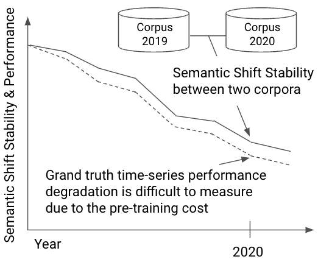
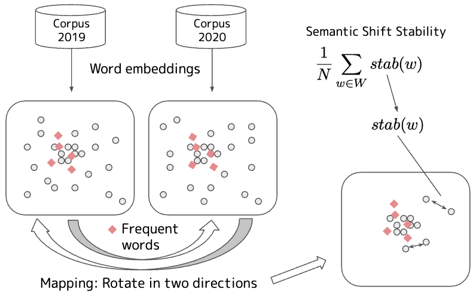

# Semantic Shift Stability: Efficient Way to Detect Performance Degradation of Word Embeddings and Pre-trained Language Models

This repository provides the implementation for calculating *Semantic Shift Stability*.
It takes two Word2vec embeddings of `gensim` as input and returns a value for the degree of semantic shift.
The smaller the value, the greater the semantic shift.
This value can be used for performance audits of pre-trained models and for analyzing social events.

## Setup

We use Python 3.8.6 and the following packages.
`gensim` >= 4.0.0 is not supported.

- numpy == 1.22.0
- pandas == 1.1.5
- gensim == 3.8.3

```bash
pip install -r requirements.txt
```

## Calculate Semantic Shift Stability

```bash
python ./src/calc_stability.py --wv1_path '/path/to/word2vec_1' --wv2_path '/path/to/word2vec_2'
2022-09-30 14:29:18,407 __main__ INFO loading /path/to/word2vec_1 ...
2022-09-30 14:30:23,939 __main__ INFO loading /path/to/word2vec_2 ...
2022-09-30 14:32:18,817 __main__ INFO semantic shift stability: 0.9980852842884843
```

Here, `wv1_path` and `wv2_path` are the paths of [Word2vec embeddings](https://radimrehurek.com/gensim/models/word2vec.html) of `gensim`.

## Background



The performance of pre-trained models is degrading by the lapse of time.
One of the solutions is re-training, but it requires a huge computational cost.
The research question is *whether we can estimate the performance before re-training?*
We use an efficiently computable metric named *Semantic Shift Stability* based on the methodology of semantic shift analysis.

## Approach



The figure shows the procedure to calculate Semantic Shift Stability from two corpora.

1. First, we create Word2vec embeddings.
1. Then, we set anchor words and introduce a rotation matrix (See `smart_procrustes_re_align_gensim` in `./src/alignment.py`).
1. Finally, Semantic Shift Stability is calculated by averaging the stability of each word (See `calculate_semantic_shift_stability` in `./src/calc_stability.py`).

## Reference

```
@article{Ishihara_jnlp2024,
  title={Semantic Shift Stability: 学習コーパス内の単語の意味変化を用いた事前学習済みモデルの時系列性能劣化の監査},
  author={石原 祥太郎 and 高橋 寛武 and 白井 穂乃},
  journal={自然言語処理},
  volume={31},
  number={4},
  pages={1563-1597},
  year={2024},
  doi={10.5715/jnlp.31.1563},
  note={in Japanese}
}

@misc{Ishihara_ic2s2_2023,
  title = "Quantifying Diachronic Language Change via Word Embeddings: Analysis of Social Events using 11 Years News Articles in Japanese and English",
  author = "Shotaro Ishihara and 
      Hiromu Takahashi and
      Hono Shirai",
  howpublished = "9th International Conference on Computational Social Science (IC2S2 2023)",
  month = july,
  year = "2023",
  url = "https://upura.github.io/pdf/ic2s2_2023_semantic_shift.pdf",
}

@InProceedings{Ishihara_aacl2022,
  title = "Semantic Shift Stability: Efficient Way to Detect Performance Degradation of Word Embeddings and Pre-trained Language Models",
  author = "Shotaro Ishihara and 
      Hiromu Takahashi and
      Hono Shirai",
  booktitle = "Proceedings of the 2nd Conference of the Asia-Pacific Chapter of the Association for Computational Linguistics and the 12th International Joint Conference on Natural Language Processing (Volume 1: Long Papers)",
  month = nov,
  year = "2022",
  address = "Online only",
  publisher = "Association for Computational Linguistics",
  url = "https://aclanthology.org/2022.aacl-main.17",
  pages = "205--216",
}

@InProceedings{Takahashi_nlp2022,
  author = "高橋 寛武 and 石原 祥太郎 and 白井 穂乃",
  title = "単語分散表現を用いた新型コロナウイルスによる意味変化検出",
  booktitle = "言語処理学会第28回年次大会(NLP2022)",
  year = "2022",
  url = "https://www.anlp.jp/proceedings/annual_meeting/2022/pdf_dir/PT3-8.pdf"
  note= "in Japanese"
}
```
