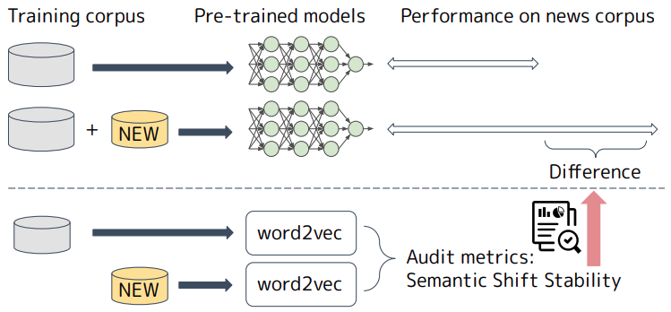

# Semantic Shift Stability: Efficient Way to Detect Performance Degradation of Word Embeddings and Pre-trained Language Models

This repository provides the implemantation for calculating *Semantic Shift Stability*.
It takes two Word2vec embeddings of `gensim` as input and returns a value for the degree of semantic shift.
The smaller the value, the greater semantic shift.

## Setup

We use Python 3.8.6 and following packages.
`gensim` >= 4.0.0 is not supported.

- numpy == 1.22.0
- pandas == 1.1.5
- gensim == 3.8.3

```bash
pip install -r requirements.txt
```

## Calculate Semantic Shift Stability

```bash
python ./src/calc_stability.py --wv1_path '/path/to/word2vec_1' --wv2_path '/path/to/word2vec_2'
2022-09-30 14:29:18,407 __main__ INFO loading /path/to/word2vec_1 ...
2022-09-30 14:30:23,939 __main__ INFO loading /path/to/word2vec_2 ...
2022-09-30 14:32:18,817 __main__ INFO semantic shift stability: 0.9980852842884843
```

Here, `wv1_path` and `wv2_path` are the paths of Word2vec embeddings of `gensim`.
https://radimrehurek.com/gensim/models/word2vec.html

## Background



The performance of word embeddings and pre-trained language models are degrading by the lapse of time. One of the solutions is re-training, but it requires huge computational cost.
The research question is *whether we can estimate the performance before re-training?*
We use an efficiently computable metric named *Semantic Shift Stability* based on the methodology of semantic shift analysis.

## Approach


The figure shows the procedure to calculate Semantic Shift Stability from two corpora.

1. First, we create Word2vec embeddings.
1. Then, we set anchor words and introduce a rotation matrix (See `smart_procrustes_re_align_gensim` in `./src/alignment.py`).
1. Finally, Semantic Shift Stability is calculated by averaging the stability of each word (See `calculate_semantic_shift_stability` in `./src/calc_stability.py`).

## Reference

```
@InProceedings{Ishihara_aacl2022,
  title = "Semantic Shift Stability: Efficient Way to Detect Performance Degradation of Word Embeddings and Pre-trained Language Models",
  author = "Shotaro Ishihara and 
      Hiromu Takahashi and
      Hono Shirai",
  booktitle = "Proceedings of the 2nd Conference of the Asia-Pacific Chapter of the Association for Computational Linguistics and the 12th International Joint Conference on Natural Language Processing",
  year = "2022",
  note = "to appear"
}

@InProceedings{Takahashi_nlp2022,
  author = "高橋寛武 and 石原祥太郎 and 白井穂乃",
  title = "単語分散表現を用いた新型コロナウイルスによる意味変化検出",
  booktitle = "言語処理学会第28回年次大会(NLP2022)",
  year = "2022",
  url = "https://www.anlp.jp/proceedings/annual_meeting/2022/pdf_dir/PT3-8.pdf"
  note= "in Japanese"
}
```
